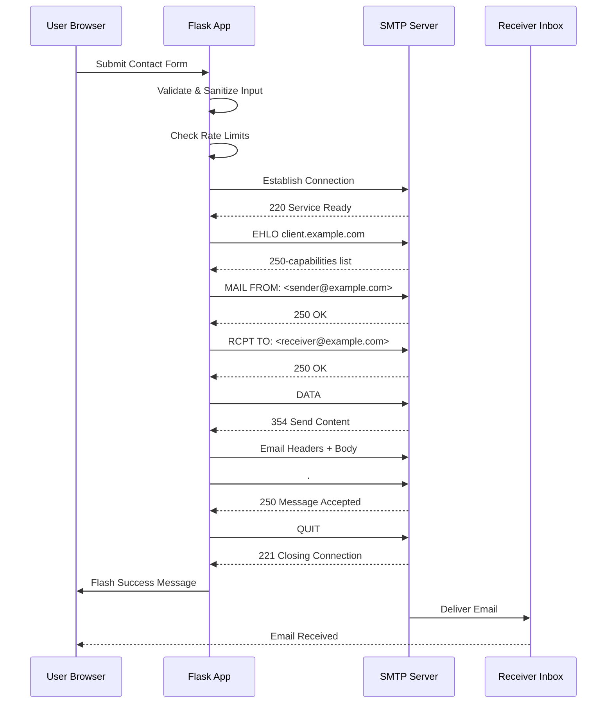

# 🚀 RFSE SMTP Implementation – Secure Flask Contact Form

A professional **RFSE SMTP Practical Implementation** using **Flask + Python**, demonstrating a **secure contact/feedback form** with real-time validation, XSS protection, and asynchronous email sending.


---

## 🌟 Features

- 📧 **SMTP Email Sending** – RFSE-compliant email dispatch via Gmail or custom SMTP
- 🛡️ **Input Sanitization** – Prevent XSS using `bleach`
- ⛔ **Rate Limiting** – Max 3 submissions per minute per IP using `flask-limiter`
- ✅ **Email Regex Validation** – Ensures proper email format
- ⚡ **Async Email Sending** – Threaded emails to avoid UI lag
- 🔐 **Environment Variables** – Secure configuration using `.env`
- 💻 **Flash Messages** – Instant success/error alerts
- 📱 **Responsive Design** – Works seamlessly on all device sizes

---

## 🧠 SMTP Workflow (RFSE Model)



---

## 🏗 Project Structure

```
.
├── app.py                 # Main Flask application
├── email_utils.py         # Email sending utilities
├── templates/
│   └── contact.html       # Contact form template
├── .env                   # Environment variables
├── requirements.txt       # Python dependencies
├── __pycache__/           # Python cache files
└── venv/                  # Virtual environment
```

---

## 🛠 Setup & Installation

### 1️⃣ Clone the Repository

```bash
git clone https://github.com/your-username/RFSE-SMTP-Contact-Form.git
cd RFSE-SMTP-Contact-Form
```

### 2️⃣ Create Virtual Environment & Install Dependencies

```bash
python -m venv venv
source venv/bin/activate   # Windows: venv\Scripts\activate
pip install -r requirements.txt
```

**requirements.txt**
```
Flask==3.0.3
python-dotenv==1.0.1
flask-limiter==3.8.0
bleach==6.1.0
```

### 3️⃣ Configure Environment Variables (`.env`)

```
SECRET_KEY=your-secret-key
SMTP_SERVER=smtp.gmail.com
SMTP_PORT=587
SMTP_USERNAME=your-email@gmail.com
SMTP_PASSWORD=your-app-password
RECEIVER_EMAIL=destination-email@example.com
```

### 4️⃣ Run the Application

```bash
python app.py
```

Visit → **[http://127.0.0.1:5000/](http://127.0.0.1:5000/)**

---

## 📜 License

Distributed under the MIT License. See `LICENSE` for more information.

MIT License © 2025 Your Name  
Made with ❤️ using **Flask & Python**

---

## 🙏 Acknowledgements

- [Flask Documentation](https://flask.palletsprojects.com/)
- [Python SMTP Library](https://docs.python.org/3/library/smtplib.html)
- [OWASP Security Guidelines](https://owasp.org/)

---

⭐ *If you find this project useful, please give it a star on GitHub!*

📧 *For any queries, contact at [your-email@example.com](mailto:your-email@example.com)*
