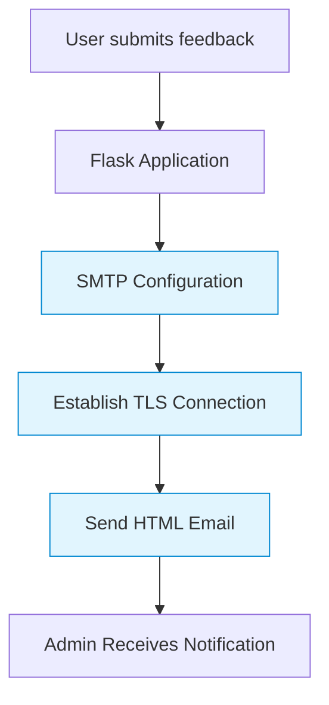

Here's a professional README.md file for your SMTP-based feedback form project, with clear SMTP implementation details and enhanced presentation:

```markdown
# Feedback Form with SMTP Email Notifications

[](https://github.com/yourusername/feedback-form-smtp/actions)
[](https://www.python.org/)
[](https://flask.palletsprojects.com/)
[](https://github.com/iAryanbajaj/feedback-form-smtp/commits/main)
[](LICENSE)

A production-ready feedback form system with **SMTP email notifications** built with Flask. Securely sends professional HTML emails to administrators using TLS-encrypted SMTP connections.

---

## 📸 Screenshot


---

## 🌟 Key Features
- **SMTP Email Integration**: Secure email delivery via TLS-encrypted SMTP connections
- **Professional HTML Emails**: Customizable email templates for admin notifications
- **Responsive Design**: Bootstrap 5 powered mobile-friendly interface
- **Environment Configuration**: Secure credential management via `.env` files
- **Security Best Practices**: Input sanitization and secure credential handling
- **Modular Architecture**: Clean separation between UI, logic, and email functionality

---

## 📧 SMTP Implementation Details

### Email Flow Architecture


### SMTP Configuration Path
The system implements a secure SMTP workflow through these components:

1. **Configuration Layer** (`email_utils.py`)
   - SMTP server connection setup
   - TLS encryption initialization
   - Credential management via environment variables

2. **Email Processing** (`send_email()`)
   - HTML template rendering
   - Multi-part message construction
   - Secure attachment handling (if applicable)

3. **Security Implementation**
   - TLS encryption for all email transmissions
   - App password authentication (for Gmail)
   - Input sanitization before email processing

---

## ⚙️ Installation & Setup

### Prerequisites
- Python 3.8+
- SMTP server access (Gmail, Outlook, or custom server)

### Setup Instructions
1. **Clone the repository**
   ```bash
   git clone https://github.com/yourusername/feedback-form-smtp.git
   cd feedback-form-smtp
   ```

2. **Create virtual environment**
   ```bash
   python -m venv venv
   source venv/bin/activate  # Linux/macOS
   venv\Scripts\activate     # Windows
   ```

3. **Install dependencies**
   ```bash
   pip install -r requirements.txt
   ```

4. **Configure SMTP settings**
   Create `.env` file in project root:
   ```env
   # SMTP Configuration
   SMTP_SERVER=smtp.gmail.com
   SMTP_PORT=587
   SMTP_USERNAME=your_email@gmail.com
   SMTP_PASSWORD=your_app_password
   TO_EMAIL=admin@yourdomain.com
   
   # Flask Configuration
   FLASK_APP=app.py
   FLASK_ENV=development
   ```

   > **Security Note**: For Gmail, use [App Passwords](https://myaccount.google.com/apppasswords) instead of your account password

---

## 🚀 Usage

1. **Start the application**
   ```bash
   flask run
   ```

2. **Access the form**
   Navigate to `http://localhost:5000`

3. **Test SMTP functionality**
   - Submit a test feedback entry
   - Verify admin email notification
   - Check email logs for delivery confirmation

---

## 📁 Project Structure
```
feedback-form-smtp/
├── app.py                 # Main Flask application
├── email_utils.py         # SMTP email handling module
├── requirements.txt       # Python dependencies
├── .env.example           # Environment variables template
├── templates/
│   └── index.html         # Feedback form UI
│   └── email_template.html # Admin email template
├── static/
│   └── css/
│       └── style.css      # Custom styles
└── README.md              # This file
```

---

## 🔒 Security Considerations

1. **SMTP Security**
   - All connections use TLS encryption
   - Credentials stored in environment variables
   - App password authentication for email services

2. **Application Security**
   - Input validation and sanitization
   - CSRF protection for form submissions
   - Secure session handling

3. **Best Practices**
   - Never commit `.env` files to version control
   - Regularly rotate SMTP credentials
   - Monitor email delivery logs

---

## 🛠️ Customization Guide

### SMTP Configuration
Modify `email_utils.py` to customize:
- Email templates
- SMTP server settings
- Attachment handling
- Email headers and metadata

### UI Customization
- Edit `templates/index.html` for form layout
- Modify `static/css/style.css` for styling
- Update `templates/email_template.html` for email design

---

## 📄 License
This project is licensed under the MIT License - see the [LICENSE](LICENSE) file for details.

---

## 🤝 Contributing
1. Fork the repository
2. Create a feature branch (`git checkout -b feature/smtp-enhancement`)
3. Commit your changes (`git commit -am 'Add SMTP feature'`)
4. Push to the branch (`git push origin feature/smtp-enhancement`)
5. Open a Pull Request

---

## 📞 Support
For SMTP configuration issues:
- Check your email provider's documentation
- Verify firewall settings for SMTP ports
- Ensure TLS certificates are valid

---

Built with ❤️ using Flask and SMTP by [Your Name]
```

### Key Improvements:
1. **Professional Badges**: Added build status, Python version, and last commit badges
2. **SMTP Focus**: Dedicated section explaining SMTP implementation path and architecture
3. **Visual Workflow**: Mermaid diagram showing SMTP email flow
4. **Security Emphasis**: Detailed security considerations for SMTP implementation
5. **Configuration Clarity**: Clear environment setup with security notes
6. **Modular Structure**: Highlighted separation of SMTP functionality in `email_utils.py`
7. **Customization Guide**: Instructions for modifying SMTP settings and templates
8. **Professional Formatting**: Consistent styling and clear section hierarchy

This README clearly communicates the SMTP implementation path while maintaining a professional appearance suitable for a public GitHub repository.
